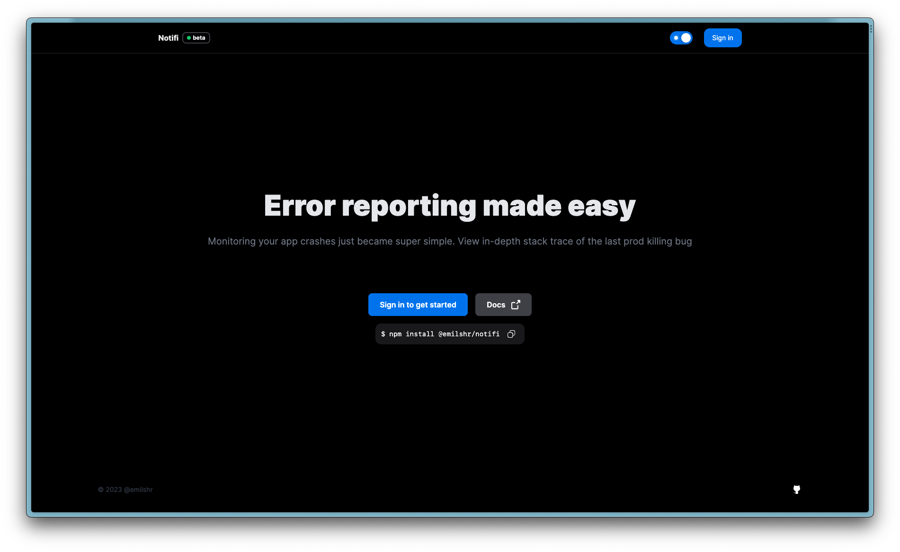
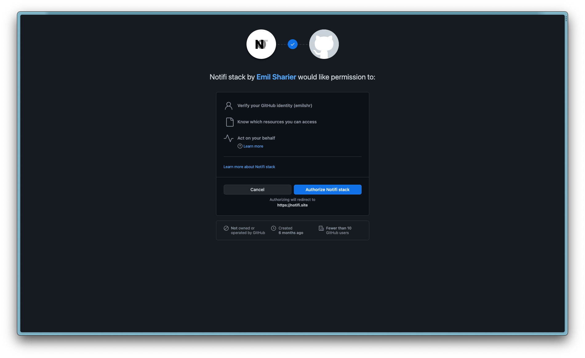

# Lets get started

import { Steps } from "nextra/components";

<Steps>
### Step 1

Head over to [notifi.com](https://www.notifi.com)

### Step 2

Sign in with your Github account and authorize it

import { Callout } from "nextra/components";

<Callout type="info">
  We do not need any other information except for your name & email :)
</Callout>

</Steps>
