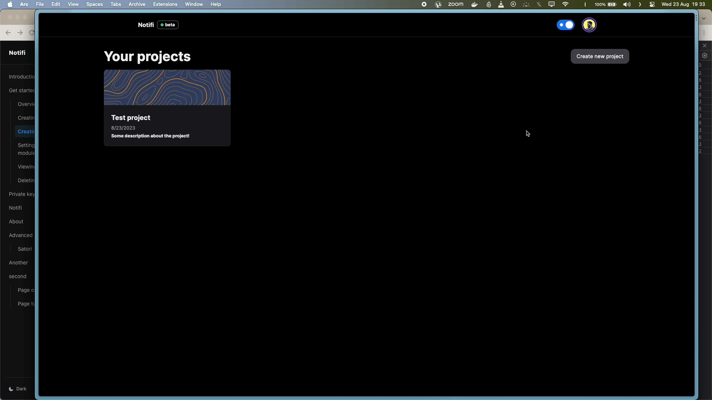

# Create a project

import { Steps } from "nextra/components";

<Steps>
### Step 1

Click on `Create new project``

### Step 2

Sign in with your Github account and authorize it

import { Callout } from "nextra/components";

### Step 3

And you're logged in. Done! :)

<Callout type="info">
  We do not need any other information except for your name & email
</Callout>

</Steps>
