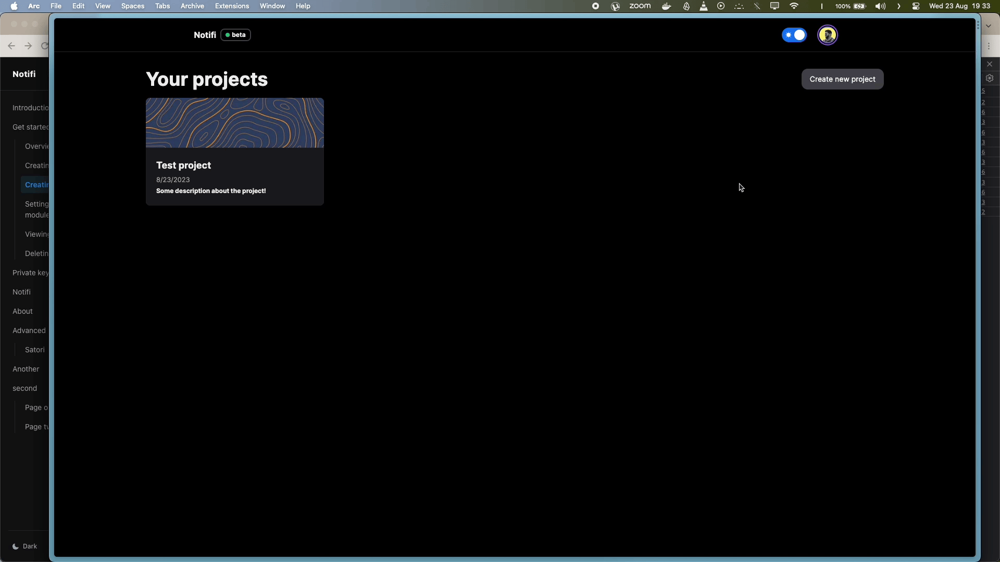
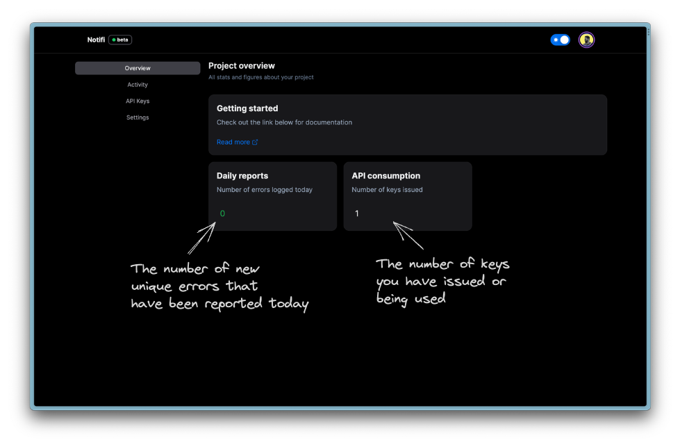
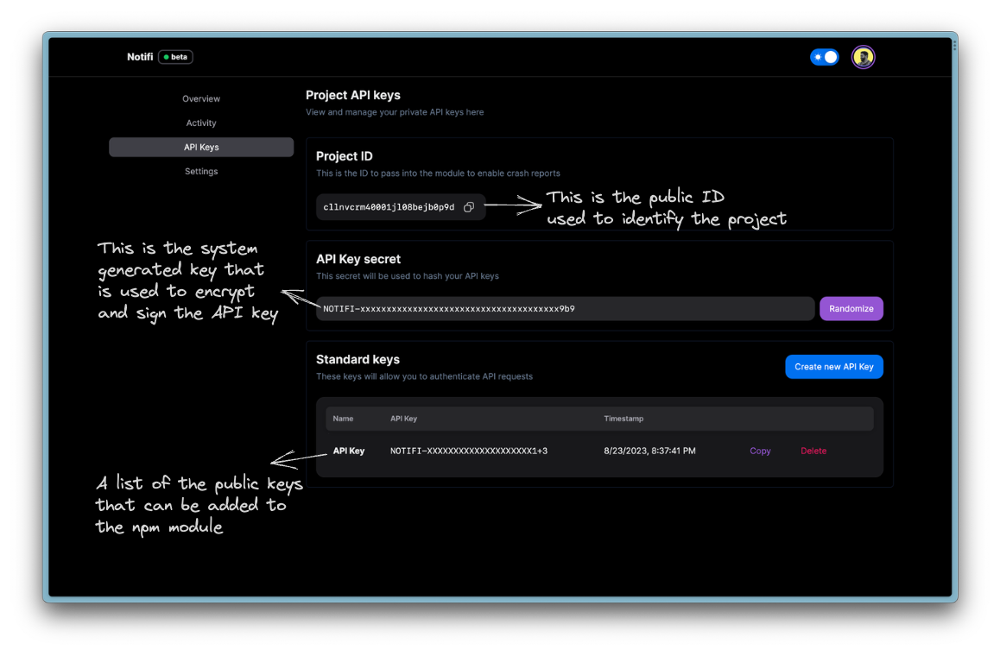

# An overview about project

A project is where you can expect to see all the errors and logs that the registered app has saved. Every API key you publish has to be associated to a project in the platform.

## Creating a project

First let's see how we can create a project

import { Steps, Callout } from "nextra/components";

<Steps>
### Naming your project

1. Click on `Create new project`

2. Give it any name & description.

<Callout type="info">Description is optional.</Callout>

### Final step

Nah. You're done 🎊

</Steps>

## Overview

Here you can find some general stats about the project

## API Keys

<Callout type="info">
  Continue reading to understand what each element represents 👇
</Callout>

### Project public ID

This is the ID of the project that you have to add while initializing the `@emilshr/notifi` package in your react app.

### API Key secret

This is a 64 bit system generated secret that is used to encrypt the API keys. Every request that the Notifi client module makes would be validated against the system using this secret key.

<Callout type="warning">
  Once you randomize the API key secret, existing API keys that are published
  and in production use would be invalid. In short, you can randomize the secret
  in order to invalidate all the existing keys
</Callout>

### Standard keys

These are 64 bit keys generated by the system which are used to authenticate a client application where the `@emilshr/notifi` module is integrated. This key is signed using the API Key secret.

<Callout type="info">
  You can create 5 different keys within a single project.
</Callout>
