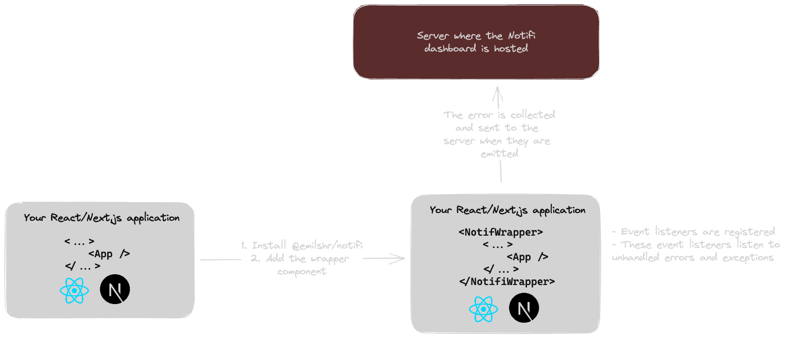

# What is this package about?

[@emilshr/notifi](https://www.npmjs.com/package/@emilshr/notifi) is a package that exports a `jsx/tsx` wrapper component that collects error and crash reports on any web application that you integrate this into.

## How does this work?

Let's visualize how the entire flow of events work. It'll be easier to understand with the help of a few diagrams.

So if you look at the architecture, you can see that you are wrapping your React tree with the `NotifiWrapper` component that [@emilshr/notifi](https://www.npmjs.com/package/@emilshr/notifi) exports. This component would then register an event listener on the web application that you integrate it to.

## Current version

I am following the [semver](https://www.educative.io/answers/what-is-semver-and-npm) versioning scheme & trying to push new features into production. Since it is semver, any major changes would mean that there will be a major version bump.

